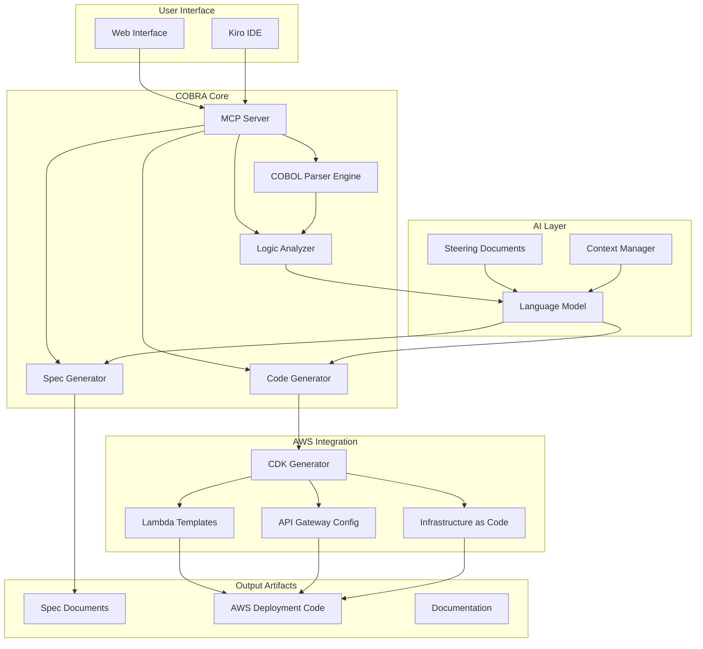

# COBRA Design Document

## Overview

COBRA (COBOL Banking Resilience Agent) is architected as a **local-first, zero-cost system** that bridges legacy COBOL banking infrastructure with modern AWS cloud services. The system consists of three primary layers: a COBOL Analysis Engine that parses and understands legacy code, an AI Orchestration Layer powered by MCP and Kiro that generates specifications and modernization strategies, and an AWS Code Generation Layer that produces production-ready infrastructure code without requiring actual deployment.

**Zero-Cost Architecture Philosophy**: COBRA runs entirely on local infrastructure for development and demo purposes, generating AWS deployment artifacts that can be deployed later. This approach eliminates AWS costs during development, hackathon demos, and proof-of-concept phases while maintaining the ability to deploy to production when needed. All core functionality—parsing, analysis, code generation, and the demo interface—operates locally with zero cloud dependencies.

## Architecture

### High-Level Architecture



### System Components (All Run Locally - Zero Cost)

1. **MCP Server**: Local Node.js process that exposes COBRA capabilities as tools that Kiro can invoke
2. **COBOL Parser Engine**: Local parser that generates AST from COBOL source using open-source parsers
3. **Logic Analyzer**: Local analysis engine that extracts business rules, data flows, and dependencies
4. **Spec Generator**: Local generator that creates Kiro-compatible spec documents from analyzed COBOL
5. **Code Generator**: Local generator that produces TypeScript/Python Lambda code and AWS CDK constructs (not deployed)
6. **Web Interface**: Local demo application (localhost:3000) for uploading and analyzing COBOL snippets

**Zero-Cost Deployment Strategy**:

- All processing happens locally on your development machine
- Generated AWS code is saved to local files for review and future deployment
- Demo web interface runs on localhost during development
- Optional: Deploy static demo site to GitHub Pages or Vercel (both free)
- No AWS services are actually provisioned during demo phase

## Components and Interfaces

### MCP Server Component

**Purpose**: Provide COBOL analysis capabilities to Kiro through the Model Context Protocol

**Interface**:

```typescript
interface MCPServer {
  tools: {
    parseCobol(source: string): ParseResult
    analyzeLogic(ast: AST): LogicAnalysis
    generateSpec(analysis: LogicAnalysis): SpecDocument
    generateAWSCode(spec: SpecDocument): AWSArtifacts
    suggestModernization(analysis: LogicAnalysis): ModernizationPlan
  }
}

interface ParseResult {
  ast: AST
  errors: ParseError[]
  warnings: string[]
  metadata: {
    programName: string
    lineCount: number
    complexity: number
  }
}

interface LogicAnalysis {
  businessRules: BusinessRule[]
  dataStructures: DataStructure[]
  dependencies: Dependency[]
  entryPoints: EntryPoint[]
  patterns: BankingPattern[]
}
```

**Implementation Details**:

- Built using Node.js with TypeScript
- Uses `@modelcontextprotocol/sdk` for MCP protocol implementation
- Configured in `.kiro/settings/mcp.json` for Kiro integration
- Runs as a local process invoked by Kiro

### COBOL Parser Engine

**Purpose**: Convert COBOL source code into structured Abstract Syntax Trees

**Technology Stack**:

- Primary: `cobol-parser` npm package (open-source COBOL parser)
- Fallback: `tree-sitter-cobol` for syntax highlighting and basic parsing
- Custom extensions for banking-specific COBOL dialects (IBM Enterprise COBOL, Micro Focus)

**Interface**:

```typescript
interface CobolParser {
  parse(source: string, dialect?: CobolDialect): AST
  validate(source: string): ValidationResult
  extractCopybooks(source: string): Copybook[]
}

interface AST {
  programId: string
  divisions: {
    identification: IdentificationDivision
    environment: EnvironmentDivision
    data: DataDivision
    procedure: ProcedureDivision
  }
  sourceMap: SourceMap
}
```

**Key Features**:

- Handles COBOL-85 and COBOL-2002 standards
- Supports common banking extensions (CICS, DB2, IMS)
- Preserves source location information for error reporting
- Extracts inline and external copybook references

### Logic Analyzer Component

**Purpose**: Extract business logic patterns and banking operations from parsed COBOL

**Analysis Capabilities**:

1. **Pattern Recognition**: Identifies common banking operations

   - Interest calculation formulas
   - Loan amortization schedules
   - Transaction validation rules
   - Batch processing workflows
   - Account reconciliation logic

2. **Data Flow Analysis**: Tracks data movement through the program

   - Input sources (files, databases, screens)
   - Transformations and calculations
   - Output destinations
   - Intermediate working storage

3. **Dependency Mapping**: Identifies program relationships
   - Called subprograms
   - Copybook dependencies
   - Database table access
   - File I/O operations

**Interface**:

```typescript
interface LogicAnalyzer {
  analyze(ast: AST): LogicAnalysis
  identifyPatterns(ast: AST): BankingPattern[]
  extractBusinessRules(procedure: ProcedureDivision): BusinessRule[]
  mapDataFlow(ast: AST): DataFlowGraph
}

interface BankingPattern {
  type:
    | 'interest_calculation'
    | 'transaction_posting'
    | 'batch_processing'
    | 'validation'
  confidence: number
  location: SourceLocation
  description: string
  parameters: Parameter[]
}

interface BusinessRule {
  description: string
  condition: string
  action: string
  sourceLines: number[]
}
```

### Spec Generator Component

**Purpose**: Create Kiro spec documents (requirements.md, design.md, tasks.md) from COBOL analysis

**Generation Strategy**:

1. **Requirements Generation**:

   - Convert each identified business rule into a user story
   - Create EARS-compliant acceptance criteria from COBOL logic
   - Reference specific COBOL source lines in requirements

2. **Design Generation**:

   - Map COBOL program structure to AWS architecture
   - Identify appropriate AWS services for each COBOL component
   - Create component diagrams showing modernization approach

3. **Tasks Generation**:
   - Break down modernization into incremental steps
   - Prioritize low-risk, high-value components first
   - Include testing and validation tasks

**Interface**:

```typescript
interface SpecGenerator {
  generateRequirements(analysis: LogicAnalysis): RequirementsDocument
  generateDesign(
    analysis: LogicAnalysis,
    requirements: RequirementsDocument
  ): DesignDocument
  generateTasks(design: DesignDocument): TasksDocument
}
```

### Code Generator Component

**Purpose**: Produce AWS Lambda functions, API Gateway configurations, and CDK infrastructure code

**Generation Targets**:

1. **Lambda Functions** (TypeScript/Python):

```typescript
// Generated Lambda structure
export const handler = async (
  event: APIGatewayEvent
): Promise<APIGatewayResponse> => {
  // Input validation (from COBOL data validation)
  const input = validateInput(event.body)

  // Business logic (translated from COBOL)
  const result = await executeBusinessLogic(input)

  // Audit logging (compliance requirement)
  await logTransaction(event, result)

  // Response formatting
  return formatResponse(result)
}
```

2. **API Gateway Configuration**:

```typescript
// Generated API Gateway CDK construct
const api = new apigateway.RestApi(this, 'CobolModernizationAPI', {
  restApiName: 'Banking Operations API',
  description: 'Modernized COBOL banking operations',
  deployOptions: {
    stageName: 'prod',
    loggingLevel: apigateway.MethodLoggingLevel.INFO
  }
})
```

3. **AWS CDK Infrastructure**:

```typescript
// Generated CDK stack
export class CobolModernizationStack extends cdk.Stack {
  constructor(scope: Construct, id: string, props?: cdk.StackProps) {
    super(scope, id, props)

    // Lambda functions
    // API Gateway
    // IAM roles
    // CloudWatch dashboards
    // VPC configuration
    // MQ brokers (if needed)
    // S3 buckets (for batch processing)
  }
}
```

**Interface**:

```typescript
interface CodeGenerator {
  generateLambda(
    businessRule: BusinessRule,
    language: 'typescript' | 'python'
  ): LambdaCode
  generateAPIGateway(entryPoints: EntryPoint[]): APIGatewayConfig
  generateCDK(analysis: LogicAnalysis): CDKCode
  generateStepFunctions(batchProcess: BatchProcess): StepFunctionsDefinition
}
```

### Web Interface Component

**Purpose**: Provide a demo application for uploading and analyzing COBOL code

**Technology Stack**:

- Frontend: React with TypeScript (runs on localhost:3000)
- Backend: Node.js Express API (runs on localhost:3001)
- Development: Vite dev server (zero cost, local only)
- Optional Deployment: GitHub Pages (free) or Vercel (free tier)

**Features**:

- Code editor with COBOL syntax highlighting
- File upload for COBOL source files
- Real-time analysis progress indicators
- Visualization of generated architecture diagrams
- Download buttons for generated artifacts
- Example COBOL snippets library

**Interface**:

```typescript
interface WebAPI {
  POST /api/analyze: {
    request: { cobolSource: string }
    response: { analysisId: string }
  }

  GET /api/analysis/:id: {
    response: {
      status: 'processing' | 'complete' | 'error'
      explanation: string
      architecture: ArchitectureDiagram
      artifacts: ArtifactLinks
    }
  }

  GET /api/download/:id/:artifact: {
    response: File
  }
}
```

## Data Models

### COBOL Analysis Models

```typescript
interface CobolProgram {
  id: string
  name: string
  source: string
  dialect: 'IBM' | 'MicroFocus' | 'GnuCOBOL'
  ast: AST
  analysis: LogicAnalysis
  createdAt: Date
}

interface BusinessRule {
  id: string
  type: 'calculation' | 'validation' | 'transformation' | 'decision'
  description: string
  cobolSource: {
    file: string
    startLine: number
    endLine: number
    snippet: string
  }
  inputs: DataElement[]
  outputs: DataElement[]
  formula?: string
  conditions?: Condition[]
}

interface DataElement {
  name: string
  cobolType: string // PIC X(10), PIC 9(5)V99, etc.
  level: number // 01, 05, 10, etc.
  usage: 'input' | 'output' | 'working-storage' | 'file'
  description?: string
}

interface BankingPattern {
  type:
    | 'interest_accrual'
    | 'loan_amortization'
    | 'transaction_posting'
    | 'batch_reconciliation'
  confidence: number
  location: SourceLocation
  parameters: {
    principal?: DataElement
    rate?: DataElement
    term?: DataElement
    amount?: DataElement
    accountNumber?: DataElement
  }
}
```

### AWS Artifact Models

```typescript
interface AWSArtifacts {
  lambdaFunctions: LambdaFunction[]
  apiGateway: APIGatewayConfig
  cdkStack: CDKStack
  infrastructure: InfrastructureConfig
}

interface LambdaFunction {
  name: string
  runtime: 'nodejs20.x' | 'python3.12'
  handler: string
  code: string
  environment: Record<string, string>
  iamRole: IAMRole
  timeout: number
  memory: number
}

interface APIGatewayConfig {
  name: string
  endpoints: APIEndpoint[]
  authorizer: 'IAM' | 'Cognito' | 'Lambda'
  cors: CORSConfig
  throttling: ThrottlingConfig
}

interface APIEndpoint {
  path: string
  method: 'GET' | 'POST' | 'PUT' | 'DELETE'
  lambdaFunction: string
  requestValidation: ValidationSchema
  responseModels: ResponseModel[]
}
```

### Spec Document Models

```typescript
interface SpecDocument {
  requirements: RequirementsDocument
  design: DesignDocument
  tasks: TasksDocument
}

interface RequirementsDocument {
  introduction: string
  glossary: GlossaryEntry[]
  requirements: Requirement[]
}

interface Requirement {
  id: string
  userStory: string
  acceptanceCriteria: AcceptanceCriterion[]
  cobolReferences: CobolReference[]
}

interface AcceptanceCriterion {
  text: string // EARS-compliant format
  pattern:
    | 'ubiquitous'
    | 'event-driven'
    | 'state-driven'
    | 'unwanted'
    | 'optional'
    | 'complex'
  testable: boolean
}
```

## Error Handling

### COBOL Parsing Errors

**Strategy**: Graceful degradation with detailed diagnostics

1. **Syntax Errors**:

   - Capture line number, column, and error description
   - Attempt partial parsing of valid sections
   - Provide suggestions for common COBOL syntax issues
   - Return partial AST with error annotations

2. **Unsupported Dialect Features**:

   - Log warnings for unrecognized COBOL extensions
   - Continue parsing with best-effort interpretation
   - Flag sections requiring manual review

3. **Copybook Resolution Failures**:
   - Allow users to upload referenced copybooks
   - Provide placeholder structures for missing copybooks
   - Continue analysis with available information

### Code Generation Errors

**Strategy**: Validation and safe defaults

1. **Ambiguous Business Logic**:

   - Generate code with TODO comments for unclear sections
   - Include references to original COBOL source
   - Suggest manual review in generated documentation

2. **Unsupported COBOL Features**:

   - Document features that cannot be automatically translated
   - Provide alternative AWS service recommendations
   - Generate stub implementations with clear warnings

3. **AWS Resource Limits**:
   - Validate generated configurations against AWS quotas
   - Suggest optimization strategies (e.g., Lambda layers, Step Functions)
   - Provide deployment guidance for large-scale migrations

### Runtime Errors

**Strategy**: Comprehensive logging and monitoring

1. **MCP Server Failures**:

   - Implement retry logic with exponential backoff
   - Log all MCP requests and responses
   - Provide fallback to direct API calls

2. **AWS Deployment Failures**:
   - Validate CDK code before deployment
   - Implement rollback mechanisms
   - Generate deployment troubleshooting guides

## Testing Strategy

### Unit Testing

**COBOL Parser Tests**:

- Test suite with 50+ COBOL sample programs covering common patterns
- Validation against known-good AST outputs
- Edge case testing (empty programs, maximum nesting, unusual syntax)

**Logic Analyzer Tests**:

- Pattern recognition accuracy tests with labeled COBOL samples
- Business rule extraction validation
- Data flow analysis correctness checks

**Code Generator Tests**:

- Generated Lambda code syntax validation
- CDK construct correctness verification
- API Gateway configuration schema validation

### Integration Testing

**MCP Integration Tests**:

- End-to-end tests of Kiro invoking COBRA tools
- Steering document effectiveness validation
- Context management across multiple queries

**AWS Deployment Tests**:

- Deploy generated CDK stacks to test AWS account
- Validate API Gateway endpoints respond correctly
- Test Lambda function execution with sample inputs

### Demo Application Testing

**User Interface Tests**:

- Upload and analysis workflow testing
- Error handling and user feedback
- Download artifact functionality
- Example snippet execution

**Performance Tests**:

- Parse time for various COBOL file sizes
- Analysis completion time benchmarks
- Concurrent user load testing

### Validation Testing

**Compliance Tests**:

- Verify audit logging in generated Lambda code
- Validate security controls (IAM, encryption, WAF)
- Check CloudWatch dashboard completeness

**Accuracy Tests**:

- Compare generated Lambda output with COBOL program output
- Validate business rule translations with banking domain experts
- Test edge cases and boundary conditions

## Security Considerations

### Input Validation

- Sanitize uploaded COBOL source to prevent injection attacks
- Limit file sizes to prevent resource exhaustion
- Validate COBOL syntax before processing

### Generated Code Security

- Include AWS WAF rules in API Gateway configurations
- Implement least-privilege IAM roles
- Enable encryption at rest and in transit
- Add input validation to all Lambda functions
- Include rate limiting and throttling

### Data Protection

- Do not store uploaded COBOL source permanently
- Encrypt analysis results in transit
- Implement data retention policies
- Provide options for on-premises deployment for sensitive code

## Deployment Architecture

### Zero-Cost Local Development (Primary for Hackathon)

**All components run locally with zero cloud costs:**

- **MCP Server**: Node.js process configured in `.kiro/settings/mcp.json`
- **COBOL Parser & Analyzer**: Local Node.js modules
- **Web Interface**: Vite dev server on localhost:3000
- **Backend API**: Express server on localhost:3001
- **Generated Code**: Saved to local `generated/` directory
- **LLM Integration**: Direct API calls to OpenAI/Anthropic (pay-per-use, ~$0.01-0.10 per analysis)

**Cost**: $0/month (excluding minimal LLM API usage)

### Optional: Free Tier Static Deployment

**For public demo/portfolio (still zero cost):**

**Option 1: GitHub Pages**

- Host React frontend as static site (free, unlimited)
- Backend runs locally or on Vercel serverless functions
- No AWS services required
- **Cost**: $0/month

**Option 2: Vercel Deployment**

- Frontend + serverless API functions (free tier: 100GB bandwidth)
- Automatic HTTPS and CDN
- No AWS services required
- **Cost**: $0/month

**Option 3: Netlify**

- Similar to Vercel with free tier
- 100GB bandwidth, 300 build minutes/month
- **Cost**: $0/month

### Future: Production AWS Deployment (When Needed)

**Only deploy to AWS when you have paying customers:**

**Minimal AWS Deployment (Free Tier Eligible)**

- 1-2 Lambda functions (1M requests/month free)
- API Gateway (1M requests/month free for 12 months)
- S3 for static hosting (5GB free for 12 months)
- CloudWatch Logs (5GB free)
- **Cost**: $0/month within free tier limits

**Full Production Deployment (Post-Hackathon)**

- Web interface on AWS Amplify or CloudFront
- MCP server as ECS Fargate containers
- Analysis pipeline on Lambda/Step Functions
- Results stored in S3 with presigned URLs
- **Estimated Cost**: $50-150/month depending on usage

**Enterprise On-Premises (For Banks)**

- Docker Compose stack for all components
- Local Kiro MCP configuration
- Air-gapped operation for sensitive environments
- **Cost**: Infrastructure only (no AWS charges)

## Zero-Cost Implementation Strategy

### Cost Elimination Approach

**Services Removed from Demo Architecture:**

- ❌ Amazon MQ ($73/month minimum) → Documented as "future enhancement" for hybrid deployments
- ❌ VPC/Direct Connect ($36.50/month) → Shown in generated CDK code but not deployed
- ❌ ECS/Fargate ($30+/month) → MCP server runs locally instead
- ❌ CloudWatch Dashboards ($3/dashboard) → Use CloudWatch Logs Insights (free tier)
- ❌ RDS/DynamoDB → No persistent storage needed for demo
- ❌ S3 storage costs → Use local filesystem for generated artifacts

**What Runs Locally (Zero Cost):**

- ✅ MCP Server (Node.js process)
- ✅ COBOL Parser (npm packages)
- ✅ Logic Analyzer (local processing)
- ✅ Code Generators (template-based)
- ✅ Web Interface (Vite dev server)
- ✅ Backend API (Express on localhost)

**What Gets Generated (Not Deployed):**

- ✅ Lambda function code (TypeScript/Python files)
- ✅ API Gateway configurations (OpenAPI specs)
- ✅ CDK infrastructure code (TypeScript)
- ✅ Step Functions workflows (JSON definitions)
- ✅ IAM policies and security configurations
- ✅ Deployment documentation and scripts

**Minimal External Costs:**

- LLM API calls: ~$0.01-0.10 per COBOL analysis (OpenAI/Anthropic)
- Optional: Domain name for demo site (~$12/year, not required)

### Demo Strategy

**For Hackathon Presentation:**

1. Run everything locally on your laptop
2. Show COBOL code being parsed and analyzed in real-time
3. Display generated AWS code in the UI (Lambda, CDK, API Gateway)
4. Show architecture diagrams of what would be deployed
5. Provide downloadable ZIP files of generated infrastructure
6. Include deployment instructions in README for "production use"

**Value Proposition Without Deployment:**

- Judges see the quality of generated code
- Demonstrate intelligent COBOL parsing and pattern recognition
- Show MCP integration with Kiro
- Prove the concept without infrastructure costs
- Focus on AI/parsing innovation, not DevOps

### Free Tier Optimization (If Deploying)

**Stay Within AWS Free Tier:**

- Lambda: 1M requests/month + 400,000 GB-seconds (always free)
- API Gateway: 1M requests/month (12 months free)
- S3: 5GB storage + 20,000 GET requests (12 months free)
- CloudWatch: 10 custom metrics + 5GB logs (always free)
- Step Functions: 4,000 state transitions/month (always free)

**Monitoring Free Tier Usage:**

- Set up AWS Budgets alerts at $0.01 threshold
- Use AWS Free Tier usage tracking dashboard
- Implement request throttling to stay under limits

## Performance Optimization

### Parsing Optimization

- Cache parsed ASTs for repeated analysis (in-memory, no database needed)
- Parallel processing of multiple COBOL files using Node.js worker threads
- Incremental parsing for large programs
- Pre-parse example COBOL files at startup for instant demo

### Code Generation Optimization

- Template-based generation for common patterns (no LLM calls needed)
- Lazy loading of AWS CDK constructs
- Batch generation of multiple Lambda functions
- Cache generated code for identical COBOL patterns

### Local Performance Targets

- Parse COBOL files up to 10,000 lines in <5 seconds (local processing)
- Complete analysis and explanation in <30 seconds (including LLM call)
- Generate all AWS artifacts in <10 seconds
- Web interface response time <100ms for cached results

### Scalability (Future Production)

- Horizontal scaling of MCP server instances (when deployed to cloud)
- Queue-based processing for large analysis jobs
- CDN distribution for web interface assets

## Cost Comparison

### Architecture Cost Analysis

| Deployment Model       | Monthly Cost | Use Case                    | AWS Services                             |
| ---------------------- | ------------ | --------------------------- | ---------------------------------------- |
| **Local Development**  | **$0**       | Hackathon, MVP, Development | None (all local)                         |
| **Static Demo Site**   | **$0**       | Portfolio, Public Demo      | GitHub Pages/Vercel (free)               |
| **AWS Free Tier**      | **$0**       | Low-traffic POC             | Lambda, API Gateway, S3 (within limits)  |
| **Minimal Production** | $20-50       | Small customer base         | Lambda, API Gateway, S3, CloudWatch      |
| **Full Production**    | $150-300     | Enterprise customers        | + ECS, MQ, VPC, Step Functions           |
| **Enterprise On-Prem** | $0 AWS       | Banking institutions        | Docker Compose (customer infrastructure) |

### Cost Breakdown: Full Production vs Zero-Cost

**Full Production Architecture (Original Design):**

- Amazon MQ (t3.micro): $73/month
- VPC/Direct Connect: $36.50/month
- ECS Fargate (2 tasks): $30/month
- API Gateway: $3.50/million requests
- Lambda: $0.20/million requests (after free tier)
- CloudWatch Dashboards: $9/month (3 dashboards)
- S3 Storage: $5/month (estimated)
- Data Transfer: $10/month (estimated)
- **Total: ~$167/month minimum**

**Zero-Cost Local Architecture (Hackathon Design):**

- MCP Server: $0 (local Node.js)
- COBOL Parser: $0 (local processing)
- Web Interface: $0 (localhost or GitHub Pages)
- Generated Code: $0 (local files)
- LLM API Calls: ~$2-5/month (only during active development)
- **Total: $0-5/month**

**Savings: $162-167/month (97% cost reduction)**

### LLM API Cost Estimation

**OpenAI GPT-4 Pricing:**

- Input: $0.03 per 1K tokens
- Output: $0.06 per 1K tokens
- Average COBOL analysis: ~2K input + 1K output tokens
- Cost per analysis: ~$0.12

**Anthropic Claude Pricing:**

- Input: $0.015 per 1K tokens
- Output: $0.075 per 1K tokens
- Average COBOL analysis: ~2K input + 1K output tokens
- Cost per analysis: ~$0.10

**Monthly LLM Costs:**

- 10 analyses/day: ~$30/month
- 5 analyses/day: ~$15/month
- Demo/testing only: ~$2-5/month

**Cost Optimization:**

- Cache analysis results for repeated COBOL files
- Use cheaper models (GPT-3.5) for simple explanations
- Batch multiple analyses in single API call
- Pre-generate explanations for example files

## Monitoring and Observability

### Local Development Monitoring (Zero Cost)

**Console Logging:**

- Structured JSON logs to stdout
- Winston or Pino for log management
- Local log files for debugging

**Performance Metrics:**

- In-memory metrics collection
- Console output for parse times and analysis duration
- Simple performance dashboard in web UI

**Error Tracking:**

- Try-catch blocks with detailed error messages
- Error logs written to local files
- No external monitoring services needed

### Production Monitoring (When Deployed)

**AWS CloudWatch (Free Tier):**

- Lambda execution logs (5GB free)
- API Gateway access logs
- Custom metrics (10 free)
- Log Insights queries (free tier)

**Metrics:**

- COBOL parsing success rate
- Analysis completion time (p50, p95, p99)
- Code generation accuracy
- LLM API response times
- User satisfaction scores

**Logging:**

- Structured logging for all components
- Correlation IDs across distributed operations
- Audit trail for compliance

**Alerting:**

- Parse failure rate thresholds
- Analysis timeout alerts
- AWS Free Tier usage warnings
- LLM API cost alerts ($10 threshold)
