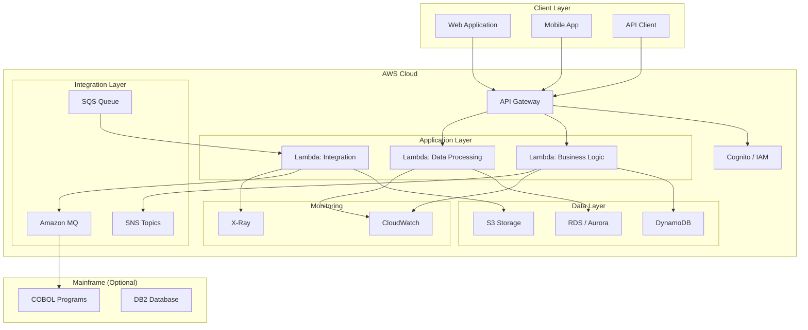

# Design Document

## Overview

[Provide a high-level description of the AWS architecture that will replace or wrap the COBOL functionality.]

**COBOL Program**: #[[file:path/to/source.cbl]]

**Modernization Approach**: [Rewrite / API Wrapper / Hybrid / Lift-and-Shift]

**Target AWS Services**: [List primary AWS services to be used]

## Architecture

### High-Level Architecture Diagram



### Architecture Decisions

| Decision    | Options Considered        | Selected   | Rationale                    |
| ----------- | ------------------------- | ---------- | ---------------------------- |
| Compute     | Lambda, ECS, EC2          | [Selected] | [Why this option was chosen] |
| Database    | DynamoDB, RDS, Aurora     | [Selected] | [Why this option was chosen] |
| API Layer   | API Gateway, ALB, AppSync | [Selected] | [Why this option was chosen] |
| Integration | MQ, SQS, EventBridge      | [Selected] | [Why this option was chosen] |
| Auth        | Cognito, IAM, Custom      | [Selected] | [Why this option was chosen] |

## Components and Interfaces

### 1. API Gateway Configuration

**Purpose**: Expose COBOL business logic as REST APIs

**Endpoints**:

```yaml
/api/v1/[resource]:
  POST:
    summary: [Operation description]
    requestBody:
      schema:
        type: object
        properties:
          [field1]: { type: string, description: '[COBOL field mapping]' }
          [field2]: { type: number, description: '[COBOL field mapping]' }
    responses:
      200:
        description: Success
        schema: [response structure]
      400:
        description: Validation error
      500:
        description: Processing error
```

**Security**:

- Authentication: [Cognito / IAM / API Key]
- Authorization: [Role-based access control]
- Rate Limiting: [requests per second]
- WAF Rules: [OWASP Top 10, rate limiting, geo-blocking]

### 2. Lambda Functions

#### Function 1: [Business Logic Function]

**Purpose**: [Translate COBOL business logic description]

**COBOL Source**: Lines [start]-[end] in #[[file:path/to/source.cbl]]

**Runtime**: [Node.js 20.x / Python 3.12]

**Memory**: [MB]

**Timeout**: [seconds]

**Environment Variables**:

- `TABLE_NAME`: DynamoDB table for [purpose]
- `API_KEY`: External service API key
- `LOG_LEVEL`: Logging verbosity

**Input Schema**:

```typescript
interface Input {
  [field1]: string // Maps to COBOL: [COBOL-FIELD-NAME]
  [field2]: number // Maps to COBOL: [COBOL-FIELD-NAME]
}
```

**Output Schema**:

```typescript
interface Output {
  [result1]: string
  [result2]: number
  status: 'SUCCESS' | 'ERROR'
}
```

**Business Logic**:

1. [Step 1: Validate input against COBOL rules]
2. [Step 2: Perform calculation/transformation]
3. [Step 3: Update data store]
4. [Step 4: Return result]

**Error Handling**:

- Input validation errors → 400 Bad Request
- Business rule violations → 422 Unprocessable Entity
- System errors → 500 Internal Server Error
- Retry logic for transient failures

---

#### Function 2: [Data Processing Function]

[Similar structure as Function 1]

---

### 3. Data Stores

#### DynamoDB Table: [TableName]

**Purpose**: [Store what data from COBOL]

**COBOL Data Structure**: [COBOL 01 level or copybook name]

**Schema**:

```typescript
interface TableItem {
  PK: string // Partition key: [COBOL field mapping]
  SK: string // Sort key: [COBOL field mapping]
  [attribute1]: string // Maps to: [COBOL-FIELD]
  [attribute2]: number // Maps to: [COBOL-FIELD]
  createdAt: string
  updatedAt: string
}
```

**Indexes**:

- GSI1: [Purpose and key structure]
- LSI1: [Purpose and key structure]

**Capacity**:

- On-Demand / Provisioned: [Choice and rationale]
- Read/Write capacity: [If provisioned]

**Backup**:

- Point-in-time recovery: Enabled
- Backup retention: [days]

---

#### RDS Database: [DatabaseName]

[If using RDS instead of or in addition to DynamoDB]

**Purpose**: [Relational data from COBOL DB2/IMS]

**Engine**: [PostgreSQL / MySQL / Aurora]

**Schema Migration**: [How COBOL data structures map to SQL tables]

---

### 4. Integration Components

#### Amazon MQ Broker (If Hybrid Architecture)

**Purpose**: Message exchange between AWS and mainframe

**Protocol**: [ActiveMQ / RabbitMQ]

**Queues**:

- `aws-to-mainframe`: [Purpose]
- `mainframe-to-aws`: [Purpose]

**Message Format**:

```json
{
  "messageType": "[type]",
  "payload": {
    // Maps to COBOL COMMAREA or message structure
  },
  "metadata": {
    "timestamp": "ISO-8601",
    "correlationId": "UUID"
  }
}
```

---

#### SQS Queues

**Purpose**: [Async processing, decoupling, retry logic]

**Queues**:

- `[queue-name]`: [Purpose]
  - Visibility timeout: [seconds]
  - Message retention: [days]
  - Dead letter queue: [DLQ name]

---

## Data Models

### COBOL to AWS Data Mapping

| COBOL Data Structure    | COBOL Type         | AWS Equivalent   | Notes                           |
| ----------------------- | ------------------ | ---------------- | ------------------------------- |
| [FIELD-NAME]            | PIC X(10)          | String           | [Mapping notes]                 |
| [AMOUNT-FIELD]          | PIC 9(7)V99 COMP-3 | Decimal / Number | [Precision handling]            |
| [DATE-FIELD]            | PIC 9(8)           | ISO-8601 String  | [Format: YYYYMMDD → YYYY-MM-DD] |
| [FLAG-FIELD]            | PIC X              | Boolean          | [Y/N → true/false]              |
| [ARRAY-FIELD] OCCURS 10 | Array              | Array            | [Index mapping]                 |

### Data Transformation Rules

1. **Date Conversion**: COBOL YYYYMMDD → ISO-8601 YYYY-MM-DD
2. **Decimal Precision**: COBOL COMP-3 → JavaScript Number with precision handling
3. **Character Encoding**: EBCDIC → UTF-8
4. **Null Handling**: COBOL spaces → null or empty string
5. **Boolean Mapping**: COBOL 'Y'/'N' → true/false

## Error Handling

### Error Categories

1. **Validation Errors** (400 Bad Request)

   - Invalid input format
   - Missing required fields
   - Out-of-range values
   - **COBOL Equivalent**: Input validation failures

2. **Business Logic Errors** (422 Unprocessable Entity)

   - Insufficient funds
   - Account not found
   - Business rule violations
   - **COBOL Equivalent**: Return codes 04, 08, 12

3. **System Errors** (500 Internal Server Error)

   - Database connection failures
   - External service timeouts
   - Unexpected exceptions
   - **COBOL Equivalent**: ABEND, return code 16

4. **Integration Errors** (502 Bad Gateway)
   - Mainframe unavailable
   - MQ connection failure
   - **COBOL Equivalent**: CICS transaction failures

### Error Response Format

```json
{
  "error": {
    "code": "[ERROR_CODE]",
    "message": "[Human-readable message]",
    "details": [
      {
        "field": "[field name]",
        "issue": "[specific issue]"
      }
    ],
    "timestamp": "[ISO-8601]",
    "requestId": "[correlation ID]"
  }
}
```

### Retry Strategy

- **Transient Errors**: Exponential backoff, max 3 retries
- **Idempotency**: Use idempotency keys for financial transactions
- **Circuit Breaker**: Fail fast after [threshold] consecutive failures
- **Dead Letter Queue**: Route failed messages after max retries

## Testing Strategy

### Unit Testing

**Lambda Functions**:

- Test business logic in isolation
- Mock AWS service calls
- Validate COBOL logic translation accuracy
- Test error handling paths

**Coverage Target**: 80% code coverage

### Integration Testing

**API Testing**:

- Test complete request/response flow
- Validate API Gateway integration
- Test authentication and authorization
- Verify error responses

**Data Testing**:

- Test DynamoDB operations
- Validate data transformations
- Test transaction rollback scenarios

### Performance Testing

**Load Testing**:

- Simulate [concurrent users/requests]
- Measure response times (p50, p95, p99)
- Identify bottlenecks
- Validate auto-scaling

**Baseline**: COBOL performance metrics

### Validation Testing

**Parallel Run**:

- Run AWS and COBOL versions simultaneously
- Compare outputs for identical inputs
- Measure accuracy (target: 99.99% match)
- Duration: [weeks/months]

**Test Data**:

- Production data samples (anonymized)
- Edge cases and boundary conditions
- Error scenarios

## Security Considerations

### Authentication and Authorization

- **API Gateway**: [Cognito / IAM / Custom authorizer]
- **Lambda Execution Role**: Least-privilege IAM policies
- **Service-to-Service**: IAM roles, no hard-coded credentials

### Data Protection

- **Encryption at Rest**: KMS encryption for DynamoDB, S3, RDS
- **Encryption in Transit**: TLS 1.2+ for all communications
- **Key Management**: Separate KMS keys per environment
- **Key Rotation**: Automatic annual rotation

### Network Security

- **VPC**: Private subnets for Lambda and RDS
- **Security Groups**: Minimal ingress/egress rules
- **WAF**: OWASP Top 10 protection, rate limiting
- **DDoS Protection**: AWS Shield Standard (automatic)

### Audit and Compliance

- **CloudWatch Logs**: All Lambda invocations logged
- **CloudTrail**: API call auditing
- **Audit Fields**: User ID, timestamp, action, result
- **Retention**: 7 years for financial transactions

## Deployment Architecture

### Environments

1. **Development**: [Configuration]
2. **Testing**: [Configuration]
3. **Staging**: [Production-like configuration]
4. **Production**: [High-availability configuration]

### CI/CD Pipeline

```mermaid
graph LR
    CODE[Code Commit] --> BUILD[Build & Test]
    BUILD --> SCAN[Security Scan]
    SCAN --> DEV[Deploy to Dev]
    DEV --> TEST[Integration Tests]
    TEST --> STAGE[Deploy to Staging]
    STAGE --> VALIDATE[Validation Tests]
    VALIDATE --> APPROVE[Manual Approval]
    APPROVE --> PROD[Deploy to Production]
    PROD --> MONITOR[Monitor & Alert]
```



### Deployment Strategy

- **Approach**: [Blue-Green / Canary / Rolling]
- **Rollback**: Automated rollback on error threshold
- **Feature Flags**: Gradual feature enablement
- **Monitoring**: Real-time metrics and alerts

## Monitoring and Observability

### Metrics

**Business Metrics**:

- Transaction success rate
- Processing time (p50, p95, p99)
- Error rate by type
- Daily transaction volume

**Technical Metrics**:

- Lambda duration and memory usage
- API Gateway latency
- DynamoDB throttling
- Error counts by function

### Alarms

- Error rate > [threshold]% → Page on-call
- Latency > [threshold]ms → Alert team
- Failed transactions > [count] → Investigate
- Cost > [budget] → Notify management

### Dashboards

- **Operations Dashboard**: Real-time system health
- **Business Dashboard**: Transaction metrics
- **Cost Dashboard**: AWS spending by service

### Logging

- **Structured Logging**: JSON format with correlation IDs
- **Log Levels**: ERROR, WARN, INFO, DEBUG
- **Log Retention**: 90 days (CloudWatch), 7 years (S3 archive)

## Cost Estimation

### Monthly Cost Breakdown

| Service     | Usage               | Cost         |
| ----------- | ------------------- | ------------ |
| Lambda      | [invocations/month] | $[amount]    |
| API Gateway | [requests/month]    | $[amount]    |
| DynamoDB    | [read/write units]  | $[amount]    |
| S3          | [GB storage]        | $[amount]    |
| CloudWatch  | [logs GB]           | $[amount]    |
| **Total**   |                     | **$[total]** |

### Cost Optimization

- Use Lambda reserved concurrency for predictable workloads
- DynamoDB on-demand for variable traffic
- S3 lifecycle policies for archival
- CloudWatch Logs retention policies

### Cost Comparison

- **Current Mainframe**: $[amount]/month (allocated)
- **AWS Target**: $[amount]/month
- **Savings**: $[amount]/month ([percentage]%)

## Migration Plan

### Phase 1: [Phase Name]

**Duration**: [weeks/months]

**Scope**: [What will be migrated]

**Approach**: [Strategy]

**Success Criteria**: [Measurable outcomes]

### Phase 2: [Phase Name]

[Similar structure]

### Rollback Plan

- Keep COBOL version active during migration
- Feature flags to switch between versions
- Automated rollback on error threshold
- Communication plan for stakeholders
